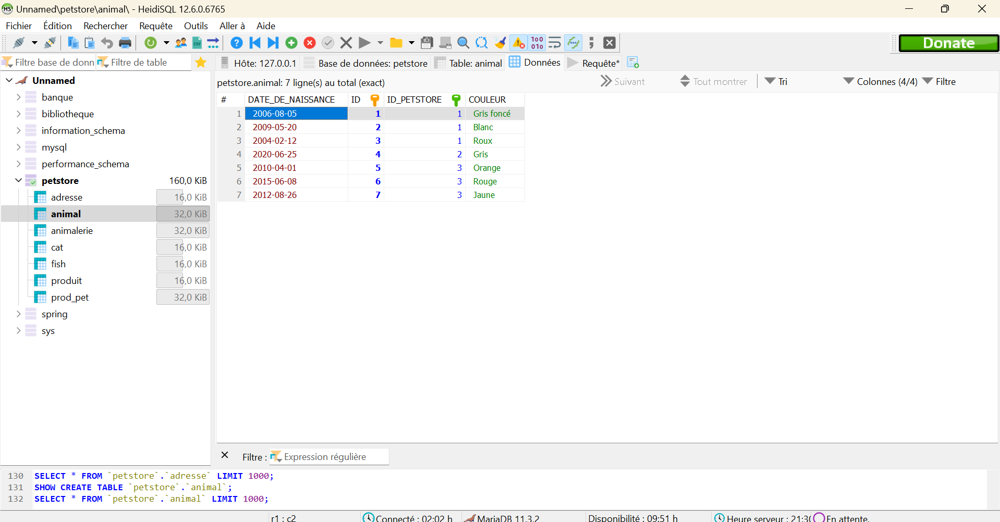

## Evaluation Java

Résultat de l'évaluation Java portant sur la réalisation d'une animalerie avec JPA par Kévin Barbin.

# Consignes d'éxécution
1) Effectuer un gitclone `https://github.com/Lingatsu/evaluation-java.git`
2) Ouvrir le répertoire projet avec Intellij Idea
3) Modifier les parties `value` du `persistence.xml` avec les informations de votre base de donnée
4) exemple : `<property name="jakarta.persistence.jdbc.url" value="jdbc:mariadb://localhost:3306/petstore"/>`
5) Lancer le fichier intitulé `TestAnimalerie` et actualiser la base de donnée

# Résultat Final
